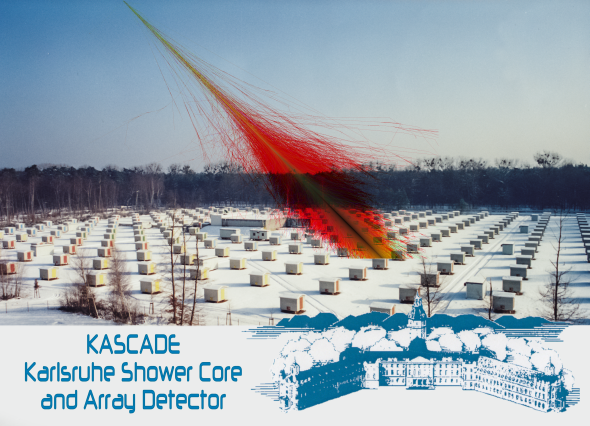

# README 

## About

Streamlit Web App to perform gamma hadron classification based on data by [KASCADE](https://www.iap.kit.edu/kascade/english/index.php) experiment.

Dataset is taken from [KASCADE Cosmic Ray Data Centre](https://kcdc.ikp.kit.edu). The application is developed for educational purposes.

## How to:

### Docker

* Biuld the image: `docker build --tag app:1.1 . `
* Run the app in the container: `docker run --publish 8344:8344 -it app:1.1`

Ready!

### Virtual environment

If you don't want to run the app in the container, you can virtual environment using 

`pipenv shell` 

and when run the app manually using 

`streamlit run app.py --server.port 8344` 

(or any other port you prefer).

## Acknowledgements

[KASCADE Cosmic Ray Data Centre](https://kcdc.ikp.kit.edu), for providing the data for the machine learning pipeline.

[Streamlit](https://streamlit.io/), for the open-source library for rapid prototyping.

[Astroparticle Physics Research group](https://research.jetbrains.org/groups/astroparticle-physics/), for fruitful discussions and inspiration. 
